# Nombre del proyecto Marketplace

# SignUp y  Login en Forms.py
```python
from django import forms
from django.contrib.auth.forms import UserCreationForm, AuthenticationForm
from django.contrib.auth.models import User

from .models import Item

class LoginForm(AuthenticationForm):
    username = forms.CharField(widget=forms.TextInput(
        attrs={
            'placeholder': 'Tu usuario',
            'class': 'form-control'
        }
    ))

    password = forms.CharField(widget=forms.PasswordInput(
        attrs={
            'placeholder': 'password',
            'class': 'form-control'
        }
    ))

class SignupForm(UserCreationForm):
    class Meta:
        model = User
        fields = ('username', 'email', 'password1', 'password2')

    username = forms.CharField(widget=forms.TextInput(
        attrs={
            'placeholder': 'Tu Usuario',
            'class': 'form-control'
        }
    ))

    email = forms.CharField(widget=forms.EmailInput(
        attrs={
            'placeholder': 'Tu Email',
            'class': 'form-control'
        }
    ))

    password1 = forms.CharField(widget=forms.PasswordInput(
        attrs={
            'placeholder': 'Password',
            'class': 'form-control'
        }
    ))

    password2 = forms.CharField(widget=forms.PasswordInput(
        attrs={
            'placeholder': 'Repite Password',
            'class': 'form-control'
        }
    ))
```

# Funciones en views.py
``` python 
from django.shortcuts import render, get_object_or_404, redirect
from django.contrib.auth import logout

from .models import Item, Category

from .forms import SignupForm

# Create your views here.
def home(request):
    items = Item.objects.filter(is_sold=False)
    categories = Category.objects.all()

    context = {
        'items' : items,
        'categories': categories
    }

    return render(request, 'store/home.html', context)

def contact(request):
    context = {
        'msg': 'Quieres otros productos contactame!'
    }

    return render(request, 'store/contact.html', context)

def detail(request, pk):
    item = get_object_or_404(Item, pk=pk)
    related_items = Item.objects.filter(category=item.category, is_sold=False).exclude(pk=pk)[0:3]

    context={
        'item': item,
        'related_items': related_items
    }

    return render(request, 'store/item.html', context)

def register(request):
    if request.method == 'POST':
        form = SignupForm(request.POST)

        if form.is_valid():
            form.save()
            return redirect('login')
    else:
        form = SignupForm()
    
    context = {
        'form': form
    }

    return render(request, 'store/signup.html', context)
```


# Login, Register urls.py
```python
from django.urls import path
from django.contrib.auth import views as auth_views
from .views import contact, detail, register

from .forms import LoginForm

urlpatterns = [
    path('contact/', contact, name='contact'),
    path('register/', register, name='register'),
    path('login/', auth_views.LoginView.as_view(template_name='store/login.html', authentication_form=LoginForm)),
    path('detail/<int:pk>/', detail, name='detail'),
]
```

# Templates templates/store login, signup
```html


Login| 



<div class="row p-4">
    <div class="col-6 bg-light p-4">
        <h4 class="mb-6 text-center">Registro</h4>
        <hr>
        <form action="." method="POST">
            
            <div class="form-floating mb-3">
                <h6>Username:</h6>
                {{form.username}}
            </div>
            <div class="form-floating mb-3">
                <h6>Password:</h6>
                {{form.password}}
            </div>
        </form>
    </div>
    
    <div class="mb-4 p-6 bg-danger">
        
            fiels.errors
        
        {{ form.non_field_errors }}
    </div>
    
</div>
<button class="btn btn-primary mb-6">Login</button>




```

```html


Registro | 


<div class="row p-4">
    <div class="col-6 bg-light p-4">
        <h4 class="mb-6 text-center">Registro</h4>
        <hr>
        <form action="." method="POST">
            
            <div class="form-floating mb-3">
                <h6>username:</h6>
                {{form.username}}
            </div>
            <div class="form-floating mb-3">
                <h6>Email:</h6>
                {{form.email}}
            </div>
            <div class="form-floating mb-3">
                <h6>Password:</h6>
                {{form.password1}}
            </div>
            <div class="form-floating mb-3">
                <h6>Repite Password:</h6>
                {{form.password2}}
            </div>

            
                <div class="mb-4 p-6 bg-danger">
                    
                        fields.errors
                    
                    {{ form.non_field_errors }}
                </div>
            

            <button class="btn btn-primary mb-6">Register</button>
        </form>
    </div>
</div>

```

# 

**Práctica Evaluatoria Parcial 3**

***Grupo: 5AMPG***

**ÍNDICE**

**[INTRODUCCIÓN	3]**

[**EXPLICACIÓN DE COMANDOS VISTOS EN CLASE	4**]

[**ARQUITECTURA MVT	6**]

[**EXPLICACIÓN DE ARCHIVOS DE DJANGO Y ¿PARA QUÉ SIRVE EL FOLDER TEMPLATES/STORE?	8**]

[**CÓDIGO DE LOS ARCHIVOS MENCIONADOS ANTERIORMENTE	10**]

[**EJECUCIÓN DEL PROYECTO	16**]

[**Explicación de Forms.py (LoginForm, SignupForm, NewItemForm)	28**]

[**Explicación de Views.py (login(), logout\_user(), detail(), add\_item())	34**]

[**Explicar decorador @login\_required	40**]

[**Explicación de Urls.py (Las rutas a cada acción nueva en views)	44**]

[**Explicación de store/templates (item.html, login.html, signup.html, navigation.html, form.html)	49**]

[**CONCLUSIÓN	63**]

# **INTRODUCCIÓN**   

En este documento se describirá el uso de Django dentro del proyecto marketplace\_main, abordando su estructura general, los comandos esenciales utilizados, los archivos más importantes del sistema y su funcionamiento práctico a lo largo de su desarrollo.

Django destaca por su enfoque en la simplicidad y en la organización del código sin perder potencia. Su arquitectura MVT (Modelo-Vista-Template) facilita la separación de responsabilidades y permite avanzar con fluidez en la construcción de aplicaciones. Además, integra herramientas listas para usar, como la autenticación de usuarios, formularios, manejo de sesiones, panel de administración y conexión a bases de datos, lo que agiliza el proceso de desarrollo y evita reconstruir funcionalidades desde cero.

En el proyecto marketplace\_main, trabajado durante las sesiones de clase, Django nos permitió transformar conceptos en una aplicación funcional. A lo largo de este documento se explicará cómo se emplearon archivos como forms.py, views.py y los distintos templates, así como el uso de decoradores como login\_required, para dar forma a funciones como el registro, inicio de sesión, visualización de productos y agregado de nuevos ítems. Con ello se muestra cómo cada componente del framework contribuye al funcionamiento del sistema y por qué Django resulta una excelente opción para construir proyectos web de manera eficiente y estructurada.

# **EXPLICACIÓN DE COMANDOS VISTOS EN CLASE**  

**cd Documents**  
Cambia el directorio actual al subdirectorio llamado Documents.

**md (nombre del alumno)**  
Sirve para crear una nueva carpeta en el directorio actual. Por ejemplo **md nombre\_alumno**

**cd (nombre del alumno)**  
Se usa para entrar a una carpeta con nombre específico desde la terminal. Por ejemplo **cd nombre\_alumno**

**python \-m venv venv**  
Crea un entorno virtual llamado venv. Este entorno permite trabajar en el proyecto con sus propias carpetas y versiones de Python sin afectar otros proyectos del sistema.

**venv\\Scripts\\activate**  
Activa el entorno virtual que se acaba de crear. Una vez activado, todas las expansiones que se instalen con pip se guardarán únicamente dentro de este entorno.

**pip install django**  
Instala el framework Django dentro del entorno virtual. Este paso es necesario para comenzar a crear y ejecutar proyectos con Django.

**pip install pillow**  
Instala la biblioteca Pillow; es necesaria para procesar y trabajar con imágenes dentro del proyecto. Es muy eficaz cuando la aplicación permite subir o mostrar imágenes.

**pip list**  
Muestra una lista de las expansiones instaladas en el entorno virtual. Permite comprobar que Django se haya instalado correctamente.

**django-admin startproject marketplace\_main**  
Crea un nuevo proyecto de Django llamado marketplace\_main; este comando genera la estructura básica del proyecto, incluyendo el archivo manage.py y la carpeta de configuración principal.

**cd marketplace\_main**  
Permite ingresar a la carpeta del proyecto recién creado; dentro de ella se encuentra el archivo manage.py, que se usa para ejecutar las tareas administrativas de Django.

**code .**  
Abre el proyecto en Visual Studio Code (o algún otro editor configurado) para poder visualizar y editar el código.

**python manage.py migrate**  
Ejecuta las migraciones iniciales que se crearon por Django. Este paso genera las tablas básicas en la base de datos necesarias para el funcionamiento del proyecto.

**python manage.py makemigrations**  
Crea los archivos de migración cuando se realizan cambios en los modelos (models.py). Estos archivos indican a Django cómo debe modificar la base de datos.

**python manage.py startapp store**  
Crea una nueva aplicación dentro del proyecto llamada store. Cada aplicación representa una parte específica del sistema (como productos, usuarios etc). Al ejecutar este comando, se genera una carpeta con el nombre store.

**python manage.py migrate**  
Después de crear los modelos en la nueva aplicación, se ejecuta nuevamente este comando para aplicar las migraciones a la base de datos y crear o actualizar las tablas definidas.

**python manage.py createsuperuser**  
Crea un usuario administrador que permite ingresar al panel de administración de Django (localhost/admin). Se debe proporcionar un nombre de usuario, correo electrónico y una contraseña.

**python manage.py runserver**  
Inicia el servidor de desarrollo de Django. Una vez ejecutado, se puede acceder al proyecto desde el navegador mediante la dirección que te da ([http://127.0.0.1:8000/](http://127.0.0.1:8000/)).

# **ARQUITECTURA MVT** 

Diagrama de la arquitectura MVT que utiliza Django

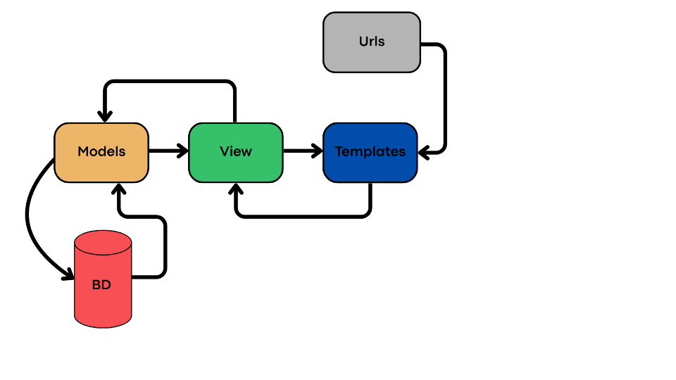

La arquitectura MVT **(Model-View-Template)** en español (Modelo-Vista-Plantilla) es el patrón que utiliza Django para poder estructurar aplicaciones web y la presentación de la aplicación web.

Componentes de la arquitectura MVT en Django:

**BD (Base de Datos):** Es la parte de aplicación que almacena los datos reales y se conecta con los **Models**, que son las clases que definen como se estructuran esos datos.  
**Models (Modelos):** Son las clases de Django que representan las tablas de la base de datos, encargados de acceder, modificar y guardar los datos. Estos models reciben los datos de la BD y los envían a la **View**.

**View (Vista):** Esta contiene la lógica del negocio, recibe solicitudes del usuario, consulta los modelos y prepara los datos para mostrar. 

**Templates (Plantillas):** Es la interfaz de la aplicación web y define como se muestra la información al usuario. El templates usa el lenguaje de plantillas de Django los cuales son: (**{{ }} y **).

**Urls (Rutas):** Las rutas son las direcciones que el usuario visita. Sirven para activar una vista, que busca datos en los modelos (**models**) y los muestra usando una plantilla (**template**).

# **EXPLICACIÓN DE ARCHIVOS DE DJANGO Y ¿PARA QUÉ SIRVE EL FOLDER TEMPLATES/STORE?** 

**Explicación de los archivos settings.py, urls.py, models.py, views.py** 

**Archivo settings.py:** El archivo settings.py es el archivo principal de configuración de un proyecto en Django. Aquí se definen todos los parámetros que controlan el funcionamiento de la aplicación. En este archivo se establece la conexión con la base de datos, las aplicaciones que forman parte del proyecto, y las rutas donde se guardan los archivos estáticos como imágenes, hojas de estilo y scripts. Además, incluye ajustes importantes de seguridad, como la clave del proyecto y la configuración para limpiar los fallos, que sirve para detectar errores mientras se desarrolla la aplicación; también se pueden definir otros aspectos, como el idioma y el horario del proyecto.

**Archivo urls.py:** El archivo urls.py es fundamental para el proyecto de Django, ya que su función principal es definir las rutas de la aplicación web. En donde se le dice a Django qué vista debe ejecutarse cuando el usuario visita una determinada dirección (URL). En pocas palabras, el archivo urls.py es el mapa de navegación de la aplicación web. Su funcionamiento es simple, el usuario visita una URL en el navegador, Django buscará la URL en el archivo urls.py, al encontrar la URL, este ejecutara la vista correspondiente.

**Archivo models.py:** El archivo models.py es donde se define la estructura de los datos que manejará una aplicación en Django. En él se crean clases que representan las entidades del sistema, y cada clase define los campos que serán las columnas de la base de datos. Django utiliza esta definición para generar las tablas correspondientes y permite manipular los datos mediante su ORM, facilitando operaciones como crear, consultar, actualizar o eliminar registros sin necesidad de escribir SQL directamente.

**Archivo views.py:** El archivo views.py en Django es el archivo donde se define la lógica que se ejecuta cuando un usuario accede a una página web. En el posterior código presentado se hace énfasis en tres funciones: home, que muestra los productos disponibles y sus categorías; contact, que presenta un mensaje de contacto; y detail, que muestra los detalles de un producto específico junto con otros productos relacionados. Cada función prepara los datos necesarios y los envía a una plantilla HTML para que se muestran en el navegador.

**¿Para qué sirve el folder templates/store?**   
La carpeta templates/ es donde se guardan las plantillas HTML que Django usará para renderizar las vistas. Mientras que store/ es la subcarpeta que coincide con la app llamada store.

Este folder “templates/store” es una estructura que utiliza Django para poder encontrar las plantillas de una forma ordenada, especialmente cuando el proyecto tiene varias apps.

# **CÓDIGO DE LOS ARCHIVOS MENCIONADOS ANTERIORMENTE** 

 **CÓDIGO DE SETTINGS.PY:**
```python
"""  
Django settings for marketplace\_main project.

Generated by 'django-admin startproject' using Django 5.2.7.

For more information on this file, see  
https://docs.djangoproject.com/en/5.2/topics/settings/

For the full list of settings and their values, see  
https://docs.djangoproject.com/en/5.2/ref/settings/  
"""

from pathlib import Path

\# Build paths inside the project like this: BASE\_DIR / 'subdir'.  
BASE\_DIR \= Path(\_\_file\_\_).resolve().parent.parent

\# Quick-start development settings \- unsuitable for production  
\# See https://docs.djangoproject.com/en/5.2/howto/deployment/checklist/

\# SECURITY WARNING: keep the secret key used in production secret\!  
SECRET\_KEY \= 'django-insecure-7\_\_w^=9l$(\&lv=t4lse(s64\_\_\!fe0+gxyi&23^$w2ido6-%no2'

\# SECURITY WARNING: don't run with debug turned on in production\!  
DEBUG \= True

ALLOWED\_HOSTS \= \[\]

\# Application definition

INSTALLED\_APPS \= \[  
    'django.contrib.admin',  
    'django.contrib.auth',  
    'django.contrib.contenttypes',  
    'django.contrib.sessions',  
    'django.contrib.messages',  
    'django.contrib.staticfiles',

    'store',  
\]

MIDDLEWARE \= \[  
    'django.middleware.security.SecurityMiddleware',  
    'django.contrib.sessions.middleware.SessionMiddleware',  
    'django.middleware.common.CommonMiddleware',  
    'django.middleware.csrf.CsrfViewMiddleware',  
    'django.contrib.auth.middleware.AuthenticationMiddleware',  
    'django.contrib.messages.middleware.MessageMiddleware',  
    'django.middleware.clickjacking.XFrameOptionsMiddleware',  
\]

ROOT\_URLCONF \= 'marketplace\_main.urls'

TEMPLATES \= \[  
    {  
        'BACKEND': 'django.template.backends.django.DjangoTemplates',  
        'DIRS': \[\],  
        'APP\_DIRS': True,  
        'OPTIONS': {  
            'context\_processors': \[  
                'django.template.context\_processors.request',  
                'django.contrib.auth.context\_processors.auth',  
                'django.contrib.messages.context\_processors.messages',  
            \],  
        },  
    },  
\]

WSGI\_APPLICATION \= 'marketplace\_main.wsgi.application'

\# Database  
\# https://docs.djangoproject.com/en/5.2/ref/settings/\#databases

DATABASES \= {  
    'default': {  
        'ENGINE': 'django.db.backends.sqlite3',  
        'NAME': BASE\_DIR / 'db.sqlite3',  
    }  
}

\# Password validation  
\# https://docs.djangoproject.com/en/5.2/ref/settings/\#auth-password-validators

AUTH\_PASSWORD\_VALIDATORS \= \[  
    {  
        'NAME': 'django.contrib.auth.password\_validation.UserAttributeSimilarityValidator',  
    },  
    {  
        'NAME': 'django.contrib.auth.password\_validation.MinimumLengthValidator',  
    },  
    {  
        'NAME': 'django.contrib.auth.password\_validation.CommonPasswordValidator',  
    },  
    {  
        'NAME': 'django.contrib.auth.password\_validation.NumericPasswordValidator',  
    },  
\]

\# Internationalization  
\# https://docs.djangoproject.com/en/5.2/topics/i18n/

LANGUAGE\_CODE \= 'en-us'

TIME\_ZONE \= 'UTC'

USE\_I18N \= True

USE\_TZ \= True

\# Static files (CSS, JavaScript, Images)  
\# https://docs.djangoproject.com/en/5.2/howto/static-files/

STATIC\_URL \= 'static/'  
MEDIA\_URL \= 'media/'  
MEDIA\_ROOT \= BASE\_DIR / 'media'  
   
\# Default primary key field type  
\# https://docs.djangoproject.com/en/5.2/ref/settings/\#default-auto-field

DEFAULT\_AUTO\_FIELD \= 'django.db.models.BigAutoField'
```

**CÓDIGO DE URLS.PY:** 
```python
from django.urls import path

from .views import contact, detail

urlpatterns \= \[  
    path('contact/', contact, name='contact'),  
    path('detail/\<int:pk\>/', detail, name='detail'),  
\]
```

**CÓDIGO DE MODELS.PY:**
```python
from django.contrib.auth.models import User  
from django.db import models

class Category (models.Model):  
    name \= models.CharField(max\_length=255)

    class Meta:  
        ordering \= ('name', )  
        verbose\_name\_plural \= 'categories'

    def \_\_str\_\_(self):  
        return self.name  
     
class Item (models.Model):  
    category \= models.ForeignKey(Category, related\_name='items', on\_delete=models.CASCADE)  
    name \= models.CharField(max\_length=255)  
    description \= models.TextField(blank=True, null=True)    
    price \= models.FloatField()  
    image \= models.ImageField(upload\_to='item\_images', blank=True, null=True)  
    is\_sold \= models.BooleanField(default=False)  
    created\_by \= models.ForeignKey(User, related\_name='items', on\_delete=models.CASCADE)  
    create\_at \= models.DateTimeField(auto\_now\_add=True)

    def \_\_str\_\_(self):  
        return self.name
```

**CÓDIGO DE VIEWS.PY:** 
```python
from django.shortcuts import render  
from .models import Item, Category  
from django.shortcuts import get\_object\_or\_404  
\# Create your views here.  
def home(request):  
    items \= Item.objects.filter(is\_sold=False)  
    categories \= Category.objects.all()

    context \= {  
        'items' : items,  
        'categories': categories  
    }

    return render(request, 'store/home.html', context)

def contact(request):  
    context \= {  
        'msg': 'Quieres otros productos contactame\!'  
    }

    return render(request, 'store/contact.html', context)

def detail(request, pk):  
    item \= get\_object\_or\_404(Item, pk=pk)  
    related\_items \= Item.objects.filter(category=item.category, is\_sold=False).exclude(pk=pk)\[0:3\]

    context={  
        'item': item,  
        'related\_items': related\_items  
    }

    return render(request, 'store/item.html', context)
```

# **EJECUCIÓN DEL PROYECTO** 

1. Muestra la interfaz de admin del proyecto, en ella podemos agregar categorías e ítems.

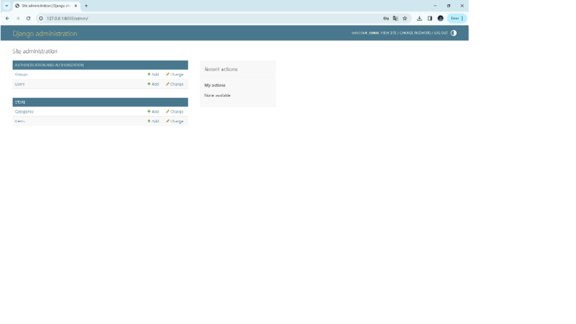

2. Muestra la interfaz del proyecto en la que podemos agregar categorías, como podemos ver, en el proyecto se han creado 3 categorías (Ropa, Videojuegos y Zapatos).

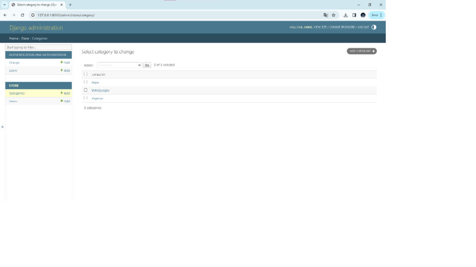

3. En esta interfaz podemos asignar el nombre a la categoría, en este caso: Ropa.

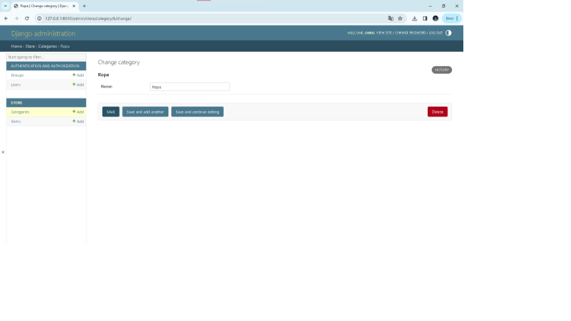

4. En esta interfaz podemos asignar el nombre a la categoría, en este caso: Videojuegos.

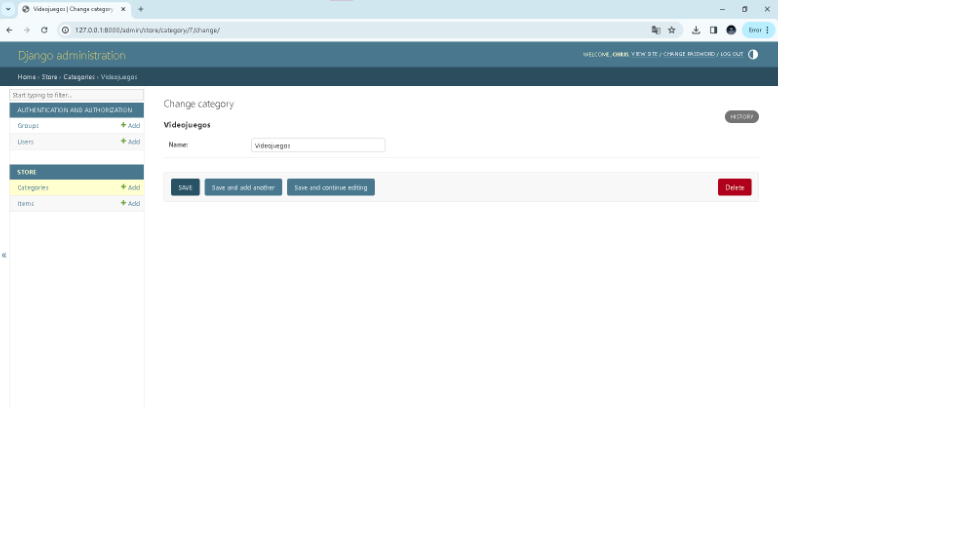

5. En esta interfaz podemos asignar el nombre a la categoría, en este caso: Zapatos.

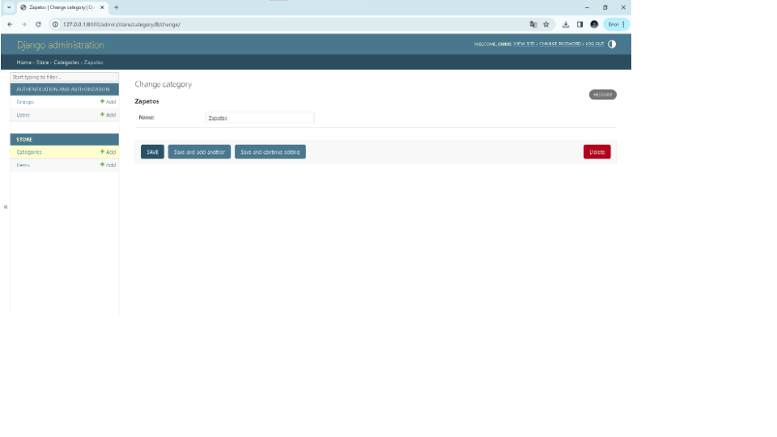

6. En esta interfaz se muestran los items agregados del proyecto (Jordan 1, Chamarra Star Wars y Nintendo Switch 2), al igual que, se pueden agregar más ítems.

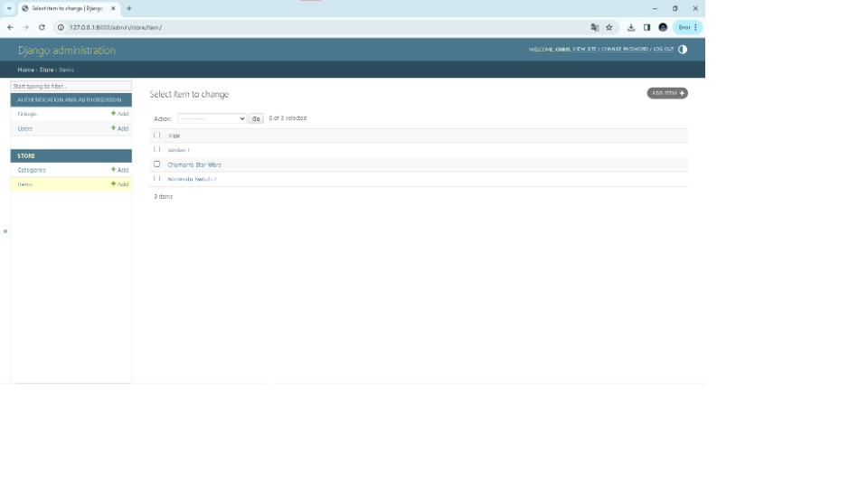

7. Interfaz del ítem Jordan 1, en él se puede asignar su categoría, nombre, descripción, asignar precio, subir imagen, y creador, posteriormente, guardar.


8. Interfaz del Chamarra Star Wars, en él se puede asignar su categoría, nombre, descripción, asignar precio, subir imagen, y creador, posteriormente, guardar.

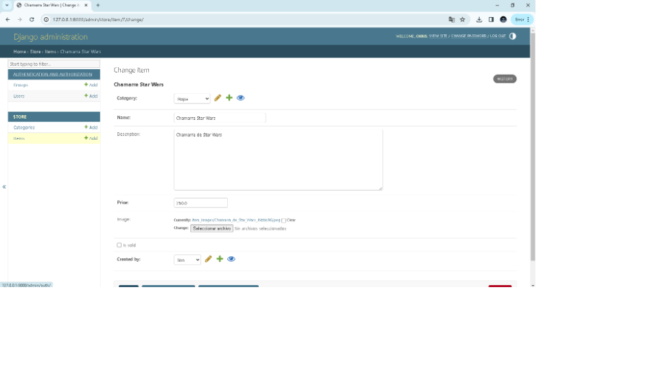

9. Interfaz del ítem Nintendo Switch 2, en él se puede asignar su categoría, nombre, descripción, asignar precio, subir imagen, y creador, posteriormente, guardar.

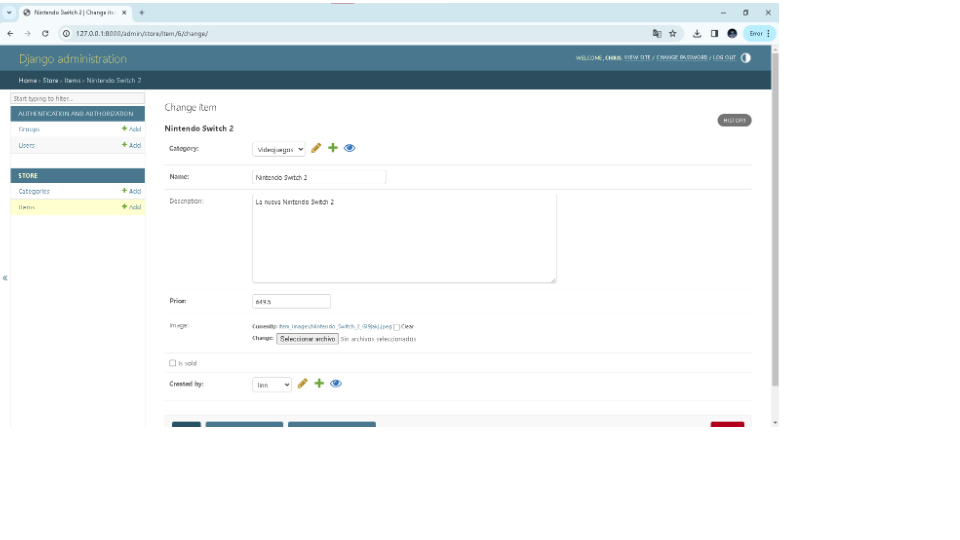

10.  Interfaz que muestra los productos agregados, desde la interfaz de admin, con su respectiva descripción.

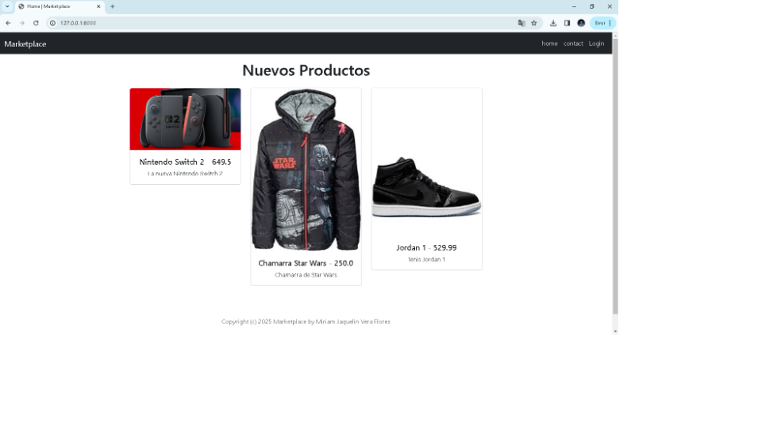

11.  Interfaz del ítem Nintendo Switch 2, al escribir en el navegador: “http://127.0.0.1:8000/store/detail/6/”

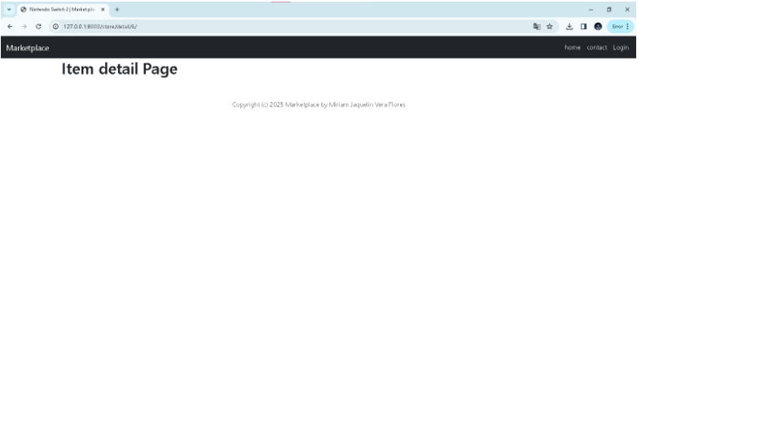

12.  Interfaz del ítem Chamarra Star Wars, al escribir en el navegador: “http://127.0.0.1:8000/store/detail/7/”

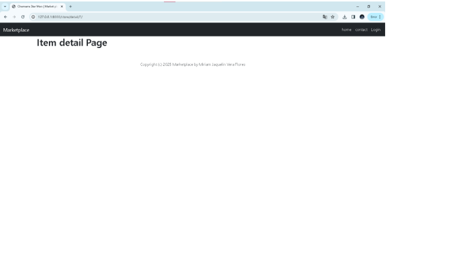

13.  Interfaz del ítem Jordan 1, al escribir en el navegador: “http://127.0.0.1:8000/store/detail/8/”

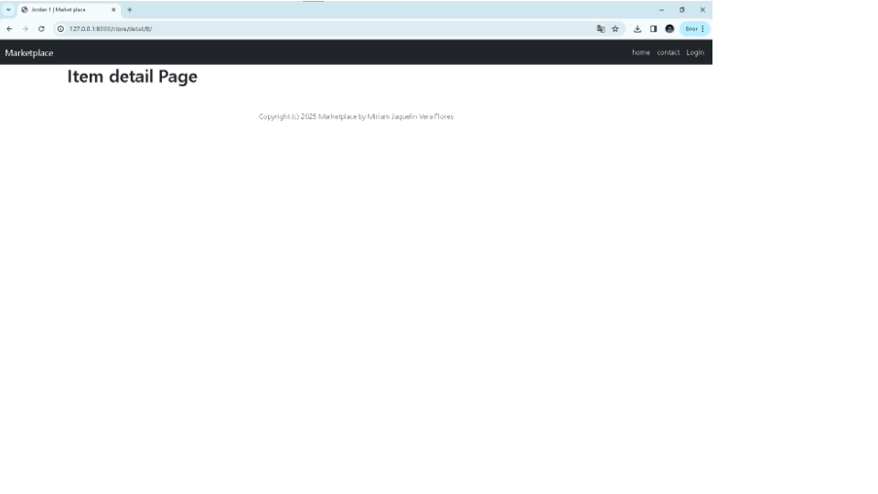

14.  Interfaz de contacto al escribir en el navegador: “http://127.0.0.1:8000/store/contact/” o al dar clic en la parte superior de la aplicación web que dice “contact”.

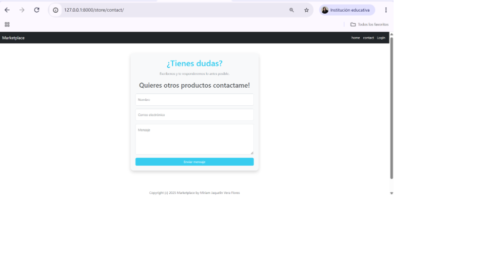

**ACTUALIZACIONES SOBRE LA EJECUCIÓN DEL PROYECTO:**

1. Nueva vista de la página principal de marketplace:

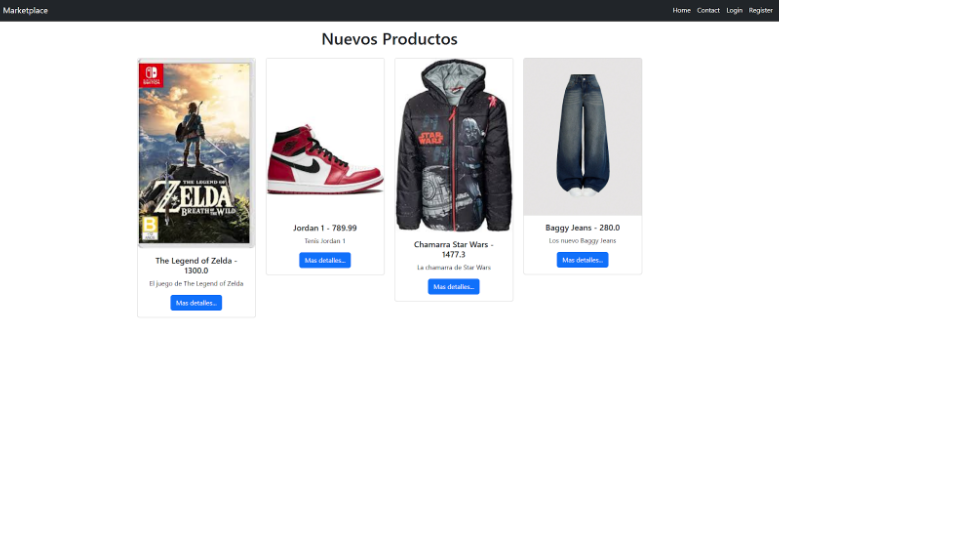

2. Vista de registro, el cual permite al usuario crear una cuenta:


3. Vista de Login; inicio de sesión del usuario:

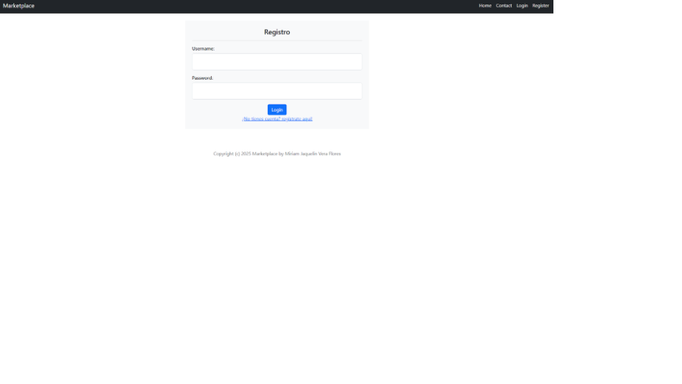

Al iniciar sesión aparecerá tu nombre de usuario en la parte superior de la aplicación:

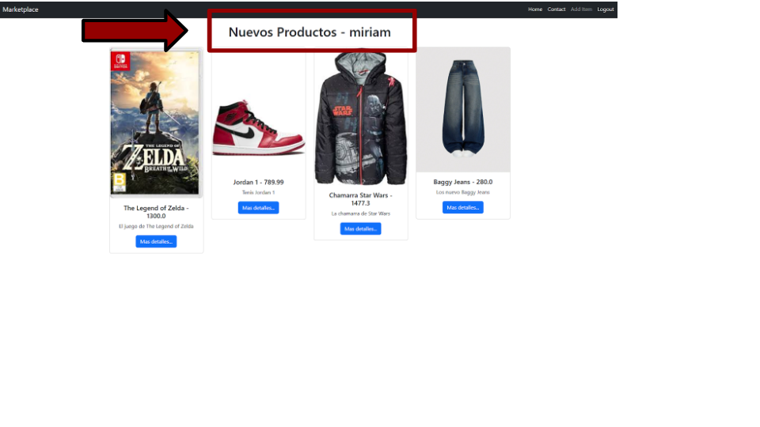

4. Vista al dar clic en Add Item (esta vista solo aparece a los usuarios que están registrados en la aplicación) permitiendo que los usuarios puedan agregar productos a store:

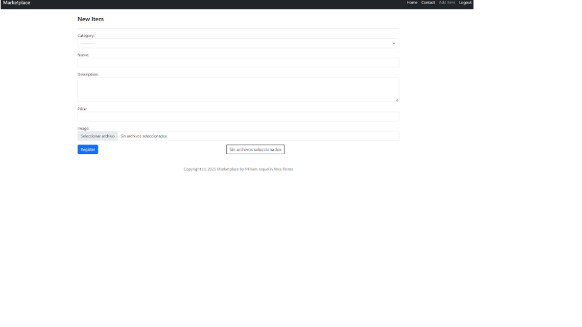

5. Al dar clic en Más detalle… muestra una vista sobre el detalle del producto:

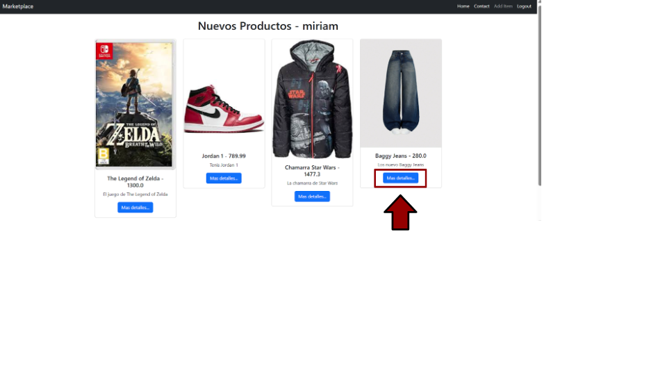

Detalles sobre el producto, el cual muestra el nombre del producto, precio, vendedor, descripción y una imagen sobre el:

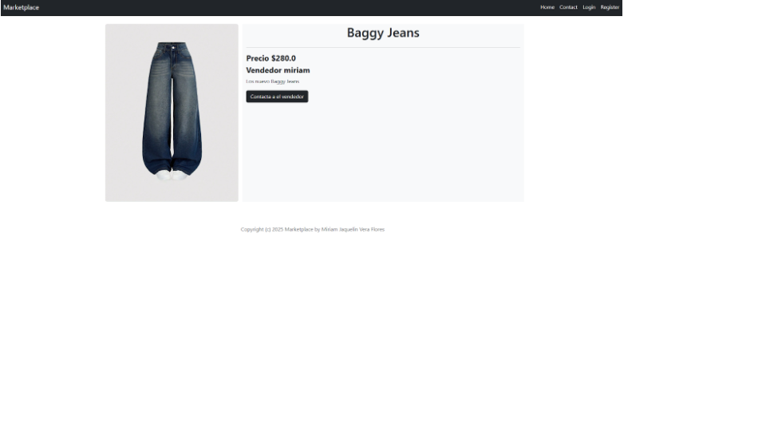

---

***ACTUALIZACIONES A CONTINUACIÓN:***

# **Explicación de Forms.py (LoginForm, SignupForm, NewItemForm)**

El archivo forms.py de la aplicación store en el proyecto  
marketplace\_main define los formularios que la aplicación utiliza para  
interactuar con los usuarios. En este podemos observar que contiene tres  
formularios principales.

El primero, **LoginForm**, extiende el formulario de autenticación de Django  
y solo personaliza la apariencia de los campos de usuario y contraseña.  
El segundo, **SignupForm**, hereda de UserCreationForm y maneja el  
registro de nuevos usuarios; también personaliza la visualización de los  
campos pero mantiene la lógica interna de Django para crear cuentas.  
El tercero, **NewItemForm**, es un ModelForm basado en el modelo Item y  
permite a los usuarios crear nuevos productos en el marketplace; define  
los campos que se mostrarán y ajusta sus widgets para controlar cómo se  
renderizarán en el formulario.

En conjunto, este archivo organiza los formularios de inicio de sesión,  
registro y creación de productos, controlando su apariencia y relación con  
los modelos sin modificar su funcionamiento interno.

**CÓDIGO DEL ARCHIVO FORMS.PY EN LA APLICACIÓN “STORE”**
```python
from django import forms  
from django.contrib.auth.forms import UserCreationForm, AuthenticationForm  
from django.contrib.auth.models import User

from .models import Item

class LoginForm(AuthenticationForm):  
    username \= forms.CharField(widget=forms.TextInput(  
        attrs={  
            'placeholder': 'Tu usuario',  
            'class': 'form-control'  
        }  
    ))

    password \= forms.CharField(widget=forms.PasswordInput(  
        attrs={  
            'placeholder': 'password',  
            'class': 'form-control'  
        }  
    ))

class SignupForm(UserCreationForm):  
    class Meta:  
        model \= User  
        fields \= ('username', 'email', 'password1', 'password2')

    username \= forms.CharField(widget=forms.TextInput(  
        attrs={  
            'placeholder': 'Tu Usuario',  
            'class': 'form-control'  
        }  
    ))

    email \= forms.CharField(widget=forms.EmailInput(  
        attrs={  
            'placeholder': 'Tu Email',  
            'class': 'form-control'  
        }  
    ))

    password1 \= forms.CharField(widget=forms.PasswordInput(  
        attrs={  
            'placeholder': 'Password',  
            'class': 'form-control'  
        }  
    ))

    password2 \= forms.CharField(widget=forms.PasswordInput(  
        attrs={  
            'placeholder': 'Repite Password',  
            'class': 'form-control'  
        }  
    ))

class NewItemForm(forms.ModelForm):  
    class Meta:  
        model \= Item  
        fields \= ('category', 'name', 'description', 'price', 'image',)

        widgets \= {  
            'category': forms.Select(attrs={  
                'class': 'form-select'  
            }),  
            'name': forms.TextInput(attrs={  
                'class': 'form-control'  
            }),  
            'description': forms.Textarea(attrs={  
                'class': 'form-control',  
                'style': 'height: 100px'  
            }),  
            'price': forms.TextInput(attrs={  
                'class': 'form-control',  
            }),  
            'price': forms.TextInput(attrs={  
                'class': 'form-control',  
            }),  
            'image': forms.FileInput(attrs={  
                'class': 'form-control',  
            }),  
        }
```

**EJECUCIÓN DE LA APLICACIÓN EN STORE:**

Este archivo nos muestra una ejecución de la página web de registro, el cual permite al usuario iniciar sesión, esta es la función de **LoginForm**:  
**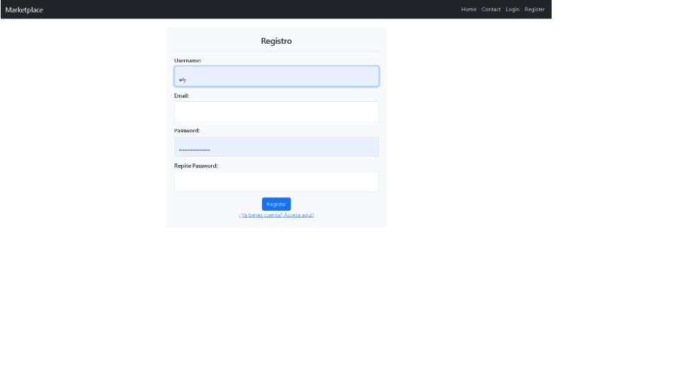**

Por otro lado tenemos a la función de **SignupForm** en la aplicación:  
****
Por último, tenemos la función de **NewItemForm** en la aplicación:  
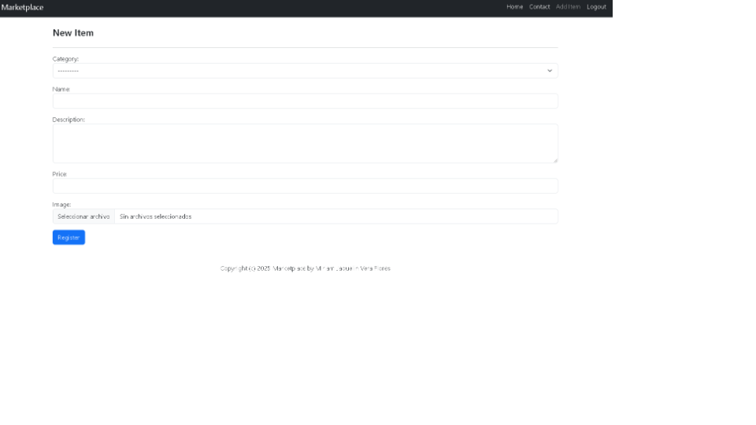

Agregamos los campos que se piden:  
**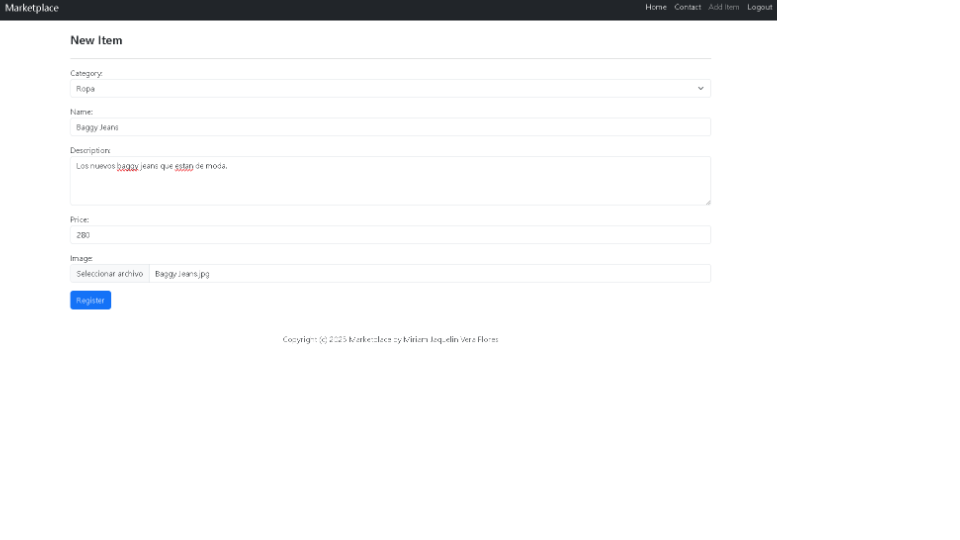**

Se agrego correctamente el ítem en la aplicación:  
**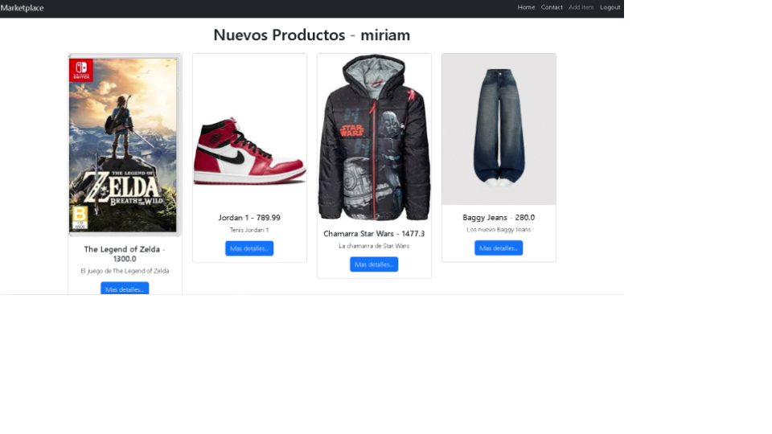**

# **Explicación de Views.py (login(), logout\_user(), detail(), add\_item())** 

**1\. Función login()**  
La función login() permite que un usuario se autentifique dentro de la aplicación. Recibe los datos enviados por el formulario de inicio de sesión (generalmente son el correo y la contraseña); verifica que correspondan a un usuario registrado y, si son correctos, inicia la sesión.

**Código**:
```python  
from django import forms  
from django.contrib.auth.forms import UserCreationForm, AuthenticationForm  
from django.contrib.auth.models import User

from .models import Item

class LoginForm(AuthenticationForm):  
    username \= forms.CharField(widget=forms.TextInput(  
        attrs={  
            'placeholder': 'Tu usuario',  
            'class': 'form-control'  
        }  
    ))
```

**EJECUCIÓN DE LA APLICACIÓN EN STORE:**

Muestra un formulario para iniciar sesión:  
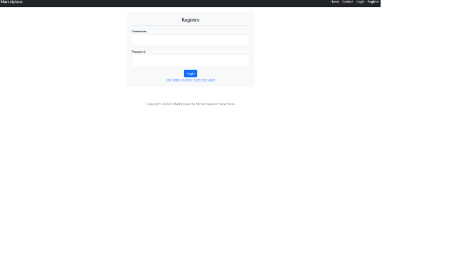  
**2\. Función logout\_user()**  
Esta vista cierra la sesión de un usuario que ya se encuentra autenticado. Elimina la información almacenada en la sesión actual y redirige al usuario a la página principal o de login.

**Código**:
```python  
from django.contrib.auth import logout

def logout\_user(request):  
    logout(request)

    return redirect('home')
```

**EJECUCIÓN DE LA APLICACIÓN EN STORE:**

Redirige a la página de inicio de sesión:  
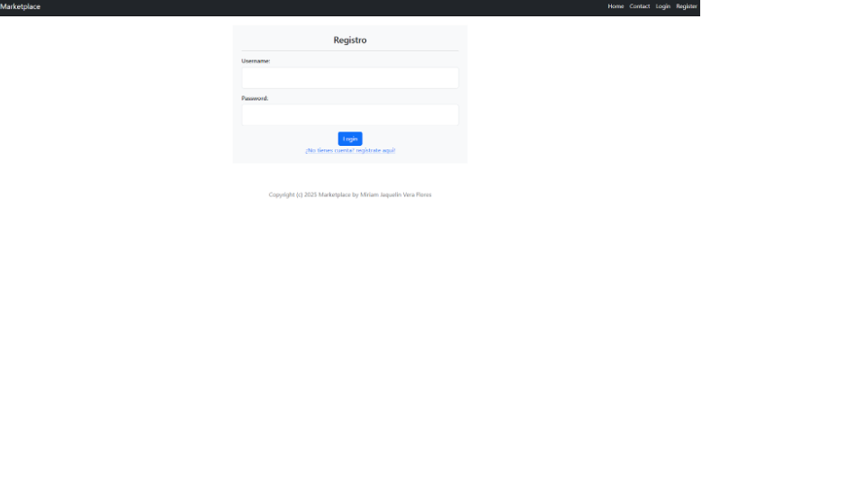

**3\. Función detail()**  
La función detail() muestra la información específica de un producto. Recibe un parámetro item\_id que permite identificar qué elemento del inventario se consultará. Localiza el objeto en la base de datos y posteriormente lo envía al template correspondiente.

**Código:**
```python  
from django.shortcuts import render, get\_object\_or\_404, redirect  
from django.contrib.auth.decorators import login\_required  
from django.contrib.auth import logout

from .models import Item, Category

from .forms import SignupForm, NewItemForm

def detail(request, pk):  
    item \= get\_object\_or\_404(Item, pk=pk)  
    related\_items \= Item.objects.filter(category=item.category, is\_sold=False).exclude(pk=pk)\[0:3\]

    context={  
        'item': item,  
        'related\_items': related\_items  
    }

    return render(request, 'store/item.html', context)
```

**EJECUCIÓN DE LA APLICACIÓN EN STORE:**

Muestra la información del item; nombre, precio, descripción e imagen:  
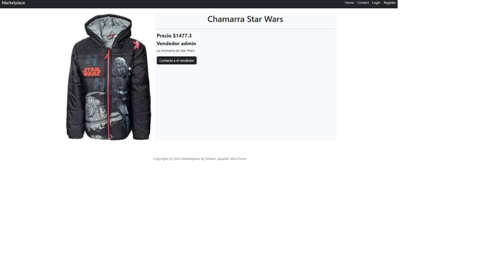

**4\. Función add\_item()**  
Esta vista permite agregar nuevos productos al inventario del marketplace. Generalmente está protegida para que sólo usuarios autenticados o administradores puedan usarla. Maneja un formulario para capturar la información del nuevo producto.

**Código:**
```python  
from django.shortcuts import render, get\_object\_or\_404, redirect  
from django.contrib.auth.decorators import login\_required  
from django.contrib.auth import logout

from .models import Item, Category

from .forms import SignupForm, NewItemForm

@login\_required  
def add\_item(request):  
    if request.method \== 'POST':  
        form \= NewItemForm(request.POST, request.FILES)

        if form.is\_valid():  
            item \= form.save(commit=False)  
            item.created\_by \= request.user  
            item.save()

            return redirect('detail', pk=item.id)  
    else:  
        form \= NewItemForm()  
        context \= {  
            'form': form,  
            'title': 'New Item'  
        }

    return render(request, 'store/form.html', context)
```

**EJECUCIÓN DE LA APLICACIÓN EN STORE:**

Al dar clic en add\_item, permite al usuario agregar un nuevo ítem (si es que tiene una cuenta registrada), añadiendo nombre, precio, imagen y descripción.  
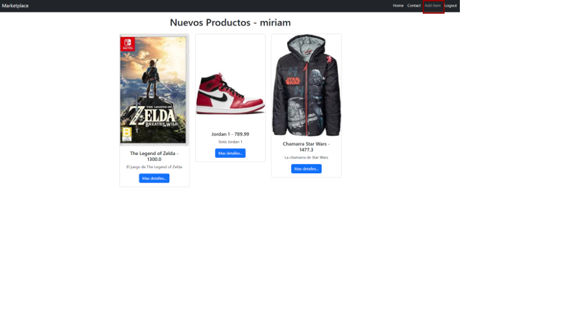

Vista que aparece al dar clic en add\_item:  
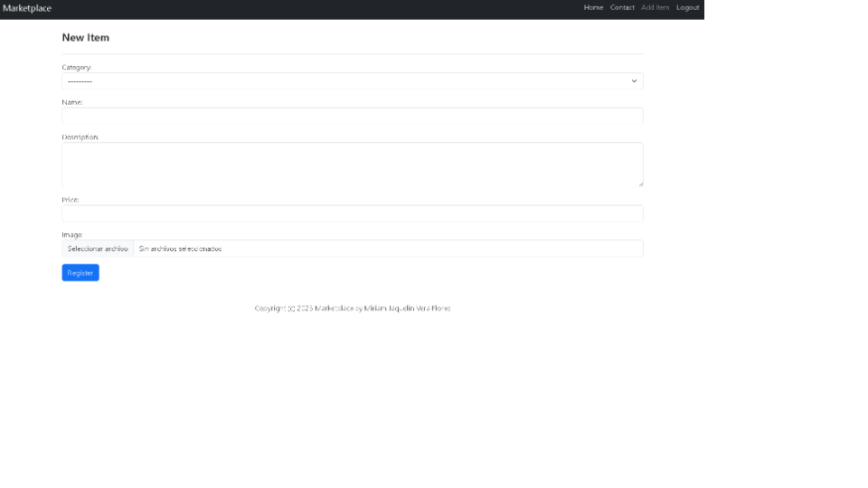

Ingresamos los datos requeridos para agregar un nuevo ítem:  
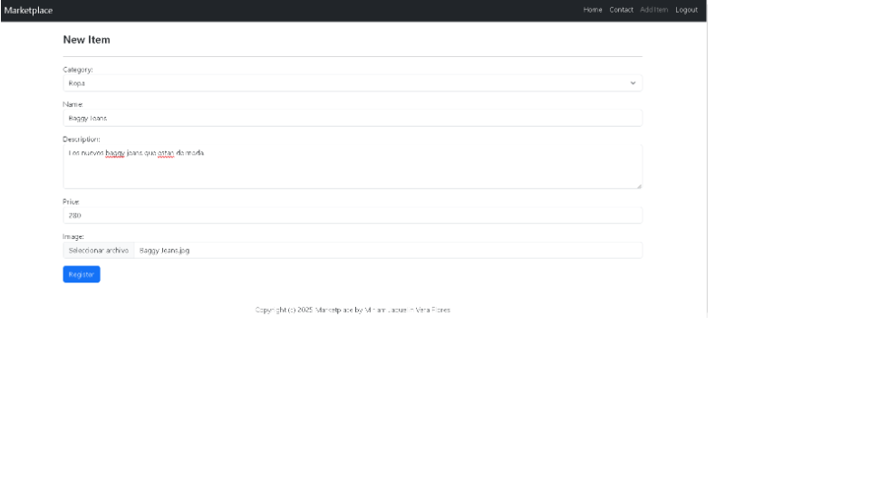

Vista que aparece al agregar el nuevo item en store:  
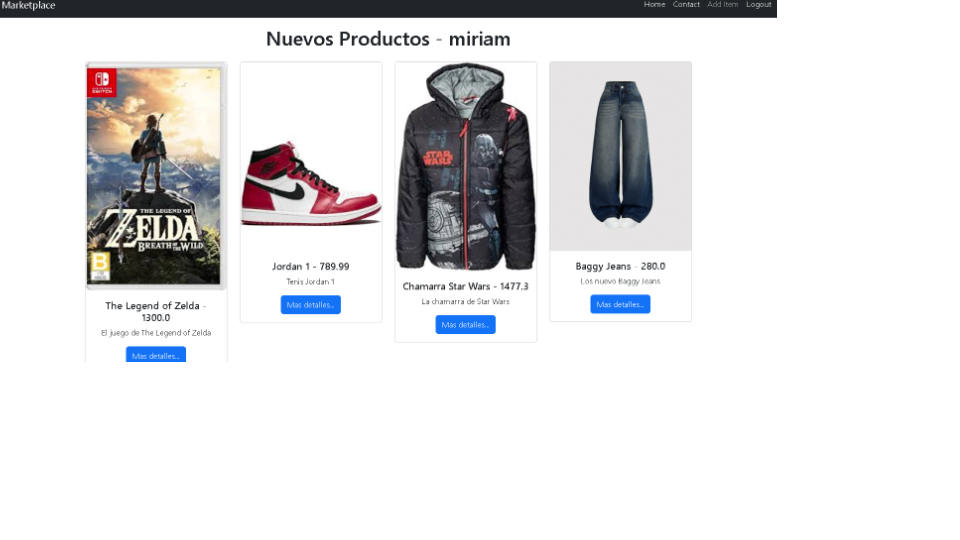

# **Explicar decorador @login\_required**

***¿Qué es el decorador @login\_required?***

El decorador @login\_required es una herramienta que ofrece Django para proteger las vistas de una aplicación web. Su función principal es restringir el acceso a determinadas páginas o funcionalidades, de manera que solo los usuarios que hayan iniciado sesión puedan acceder a ellas.

En otras palabras, si un usuario intenta entrar a una vista protegida sin estar autenticado, Django lo redirige automáticamente a la página de inicio de sesión

***¿Cómo funciona?***

* Se coloca encima de la función de la vista que queremos proteger.  
* Django verifica si el usuario está autenticado:  
  * Si lo está, se ejecuta la vista normalmente.  
  * Si no lo está, se redirige al login.

En pocas palabras lo que hace es:

* Simplifica la implementación de restricciones de acceso.  
* Se redirige automáticamente al formulario de inicio de sesión cuando el usuario no está autenticado.  
* Permite personalizar la URL de login y el comportamiento de redirección.  
* Favorece la construcción de aplicaciones más seguras y organizadas.

**CÓDIGO**:
```python
from django.contrib.auth.decorators import login\_required

@login\_required

def add\_item(request):

    if request.method \== 'POST':

        form \= NewItemForm(request.POST, request.FILES)

        if form.is\_valid():

            item \= form.save(commit=False)

            item.created\_by \= request.user

            item.save()

            return redirect('detail', pk=item.id)

    else:

        form \= NewItemForm()

        context \= {

            'form': form,

            'title': 'New Item'

        }

    return render(request, 'store/form.html', context)
```

**EJECUCIÓN DE LA APLICACIÓN EN STORE:**

Entramos con nuestra cuenta de usuario ya que es requerido para esta función: @login\_required

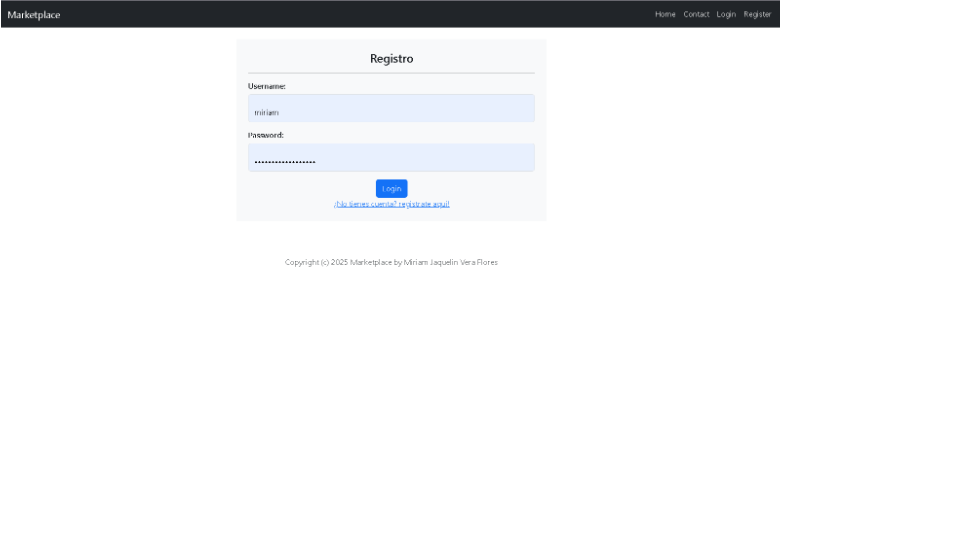

Al entrar a nuestra cuenta de usuario, nos dará la opción de agregar un item, ya que se cumplio la función: @login\_required

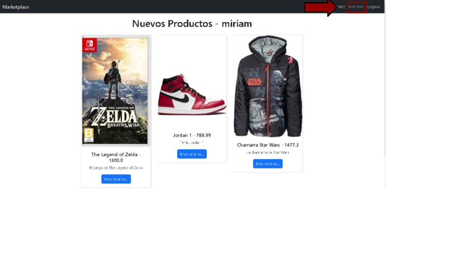

Vista que aparece al dar clic en Add Item:  
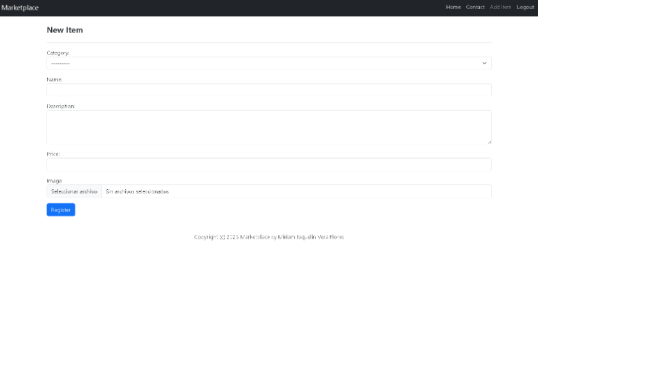

# **Explicación de Urls.py (Las rutas a cada acción nueva en views)**

El archivo urls.py nos ayuda a definir las rutas principales de la página web al utilizar Django, conectando así las URLs con las vistas que manejan acciones como: contact, register, login, logout, añadir ítems y ver detalles.

En urls.py, urlpatterns es una lista que contiene todas las rutas de la aplicación. Cada path() nos define: la URL que el usuario escribe en el navegador, un nombre que sirve de referencia para la ruta en plantillas o redirecciones, y la vista que se ejecuta cuando se accede a esa URL.

**Descripción de las rutas:**

**contact/:** Muestra un formulario de contacto, este formulario permite que el usuario envíe mensajes.

**register/:** Permite que se registre un nuevo usuario en el sistema.

**login/ (vista asociada con LoginForm):** Nos muestra una página de inicio de sesión. Usando un formulario personalizado (LoginForm) y una plantilla específica la cual es (store/login.html).

**logout/:** Cierra la sesión del usuario y lo redirige a otra página, por ejemplo a la página de inicio o a la página de inicio de sesión.

**add\_item:** Acción para agregar un nuevo elemento, es decir un nuevo ítem.

**detail/\<int:pk\>/:** Muestra el detalle de un ítem en específico identificado por su primary key (pk).  
**CODIGO DE URLS.PY:**
```python
from django.urls import path  
from django.contrib.auth import views as auth\_views  
from .views import contact, detail, register, logout\_user, add\_item

from .forms import LoginForm

urlpatterns \= \[  
    path('contact/', contact, name='contact'),  
    path('register/', register, name='register'),  
    path('login/', auth\_views.LoginView.as\_view(template\_name='store/login.html', authentication\_form=LoginForm), name='login'),  
    path('logout/', logout\_user, name='logout'),  
    path('add\_item/', add\_item, name='add\_item'),  
    path('detail/\<int:pk\>/', detail, name='detail'),  
\]
```

**EJECUCIÓN DE LA APLICACIÓN EN STORE:**

Vista de contact:  
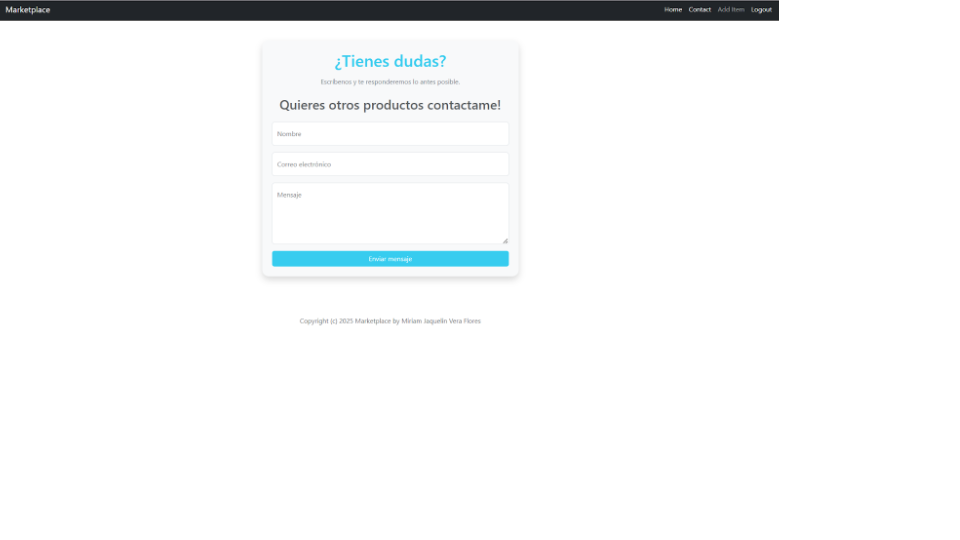

Vista de Register:  
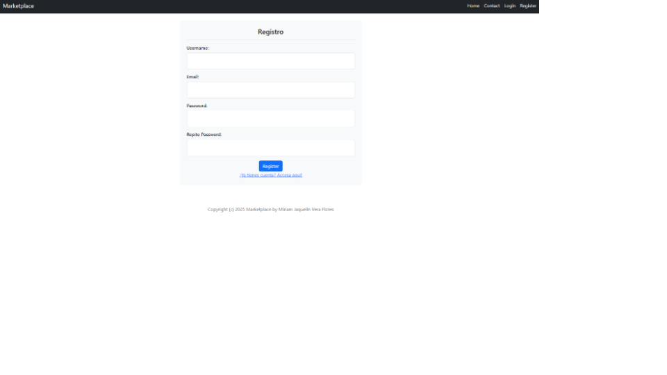

Vista de login y logout:  


Vista de add\_item:  
Al dar clic en add\_item, permite al usuario agregar un nuevo ítem, añadiendo nombre, precio, imagen y descripción.  


Vista que aparece al dar clic en add\_item:  
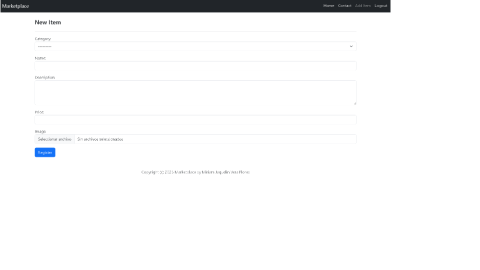

Vista de detail/\<int:pk\>/:   
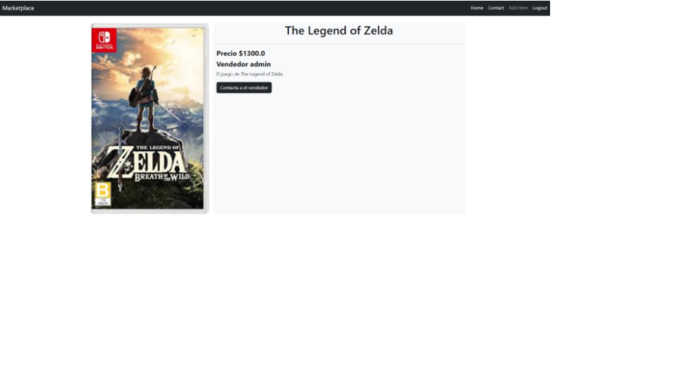

# **Explicación de store/templates (item.html, login.html, signup.html, navigation.html, form.html)** 

En Django, los **templates** son archivos HTML que definen la parte visual de la aplicación y se combinan con datos enviados desde las *views*. Se guardan en la carpeta store/templates/ y permiten mostrar páginas completas o fragmentos reutilizables.

El archivo **item.html** tiene como cometido mostrar la información de un producto específico. Allí se presentan detalles como nombre, precio, descripción e imagen, además de botones para acciones como “Contacta a el vendedor”. Es el template que se usa cuando un usuario consulta un artículo en la tienda.

**CÓDIGO DE ITEM.HTML**
```html


{{item.name}} | 



\<div class\="container mt-4 mb-4"\>

    \<div class\="row"\>

        \<div class\="col-4"\>

            \

        \</div\>

        \<div class\="col-8 p-4-rounded bg-light"\>

            \<h1 class\="mb-4 text-center"\>

                {{ item.name }}

            \</h1\>

            \<hr\>

            \<h4\>\<strong\>Precio ${{ item.price }}\</strong\>\</h4\>

            \<h4\>\<strong\>Vendedor {{ item.created\_by.username }}\</strong\>\</h4\>

            

                \<p\>{{ item.description }}\</p\>

            

            \<a href\="" class\="btn btn-dark"\>Contacta a el vendedor\</a\>

        \</div\>

    \</div\>

\</div\>


```

**EJECUCIÓN DE LA APLICACIÓN EN STORE:**

Al entrar a nuestra página web, damos clic en “Mas detalles…”:

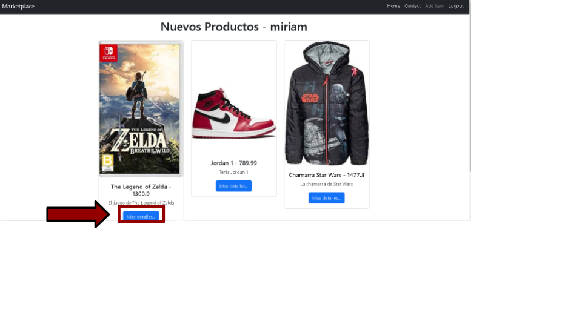

Al dar clic, nos saldrá la vista del ítem con su respectiva información:

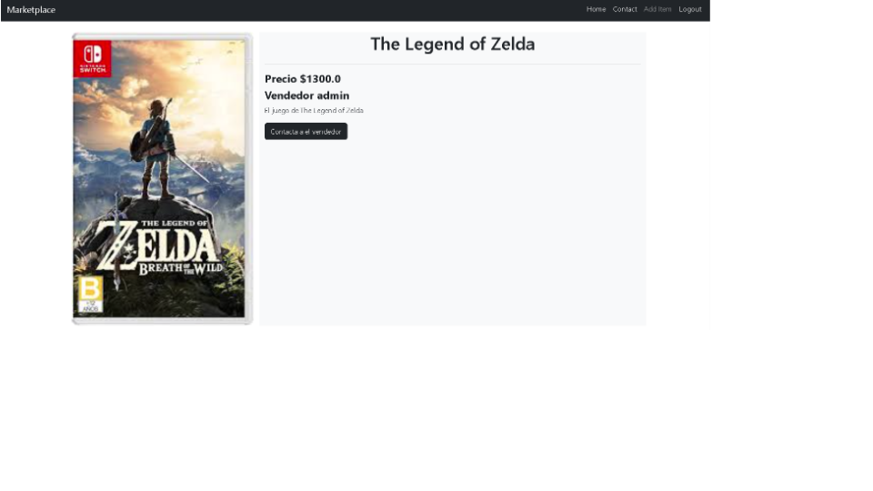

---

El archivo **login.html** corresponde a la página de inicio de sesión. Su cometido es autenticar al usuario dentro del sistema, mostrando un formulario con campos de usuario y contraseña. Normalmente se conecta con el formulario de autenticación de Django y permite acceder a las funciones de la tienda.

**CÓDIGO DE LOGIN.HTML**
```html


Login| 



\<div class\="row p-4 d-flex justify-content-center align-items-center"\>

    \<div class\="col-6 bg-light p-4"\>

        \<h4 class\="mb-6 text-center"\>Registro\</h4\>

        \<hr\>

        \<form action\="." method\="POST"\>

            

            \<div class\="form-floating mb-3"\>

                \<h6\>Username:\</h6\>

                {{form.username}}

            \</div\>

            \<div class\="form-floating mb-3"\>

                \<h6\>Password:\</h6\>

                {{form.password}}

            \</div\>

            

            \<div class\="mb-4 p-6 bg-danger text-white rounded"\>

                

                field.errors

                

                {{ form.non\_field\_errors }}

            \</div\>

            

            \<div class\="d-flex justify-content-center align-items-center"\>

                \<button class\="btn btn-primary mb-6"\>Login\</button\>

            \</div\>

            \<div class\="d-flex justify-content-center align-items-center"\>

                \<a href\=""\>¿No tienes cuenta? registrate aqui\!\</a\>

            \</div\>

        \</form\>

    \</div\>

\</div\>


```

**EJECUCIÓN DE LA APLICACIÓN EN STORE:**

Nos dirigimos al apartado de Login, el cual nos dara la opcion de iniciar sesión en nuestra cuenta:

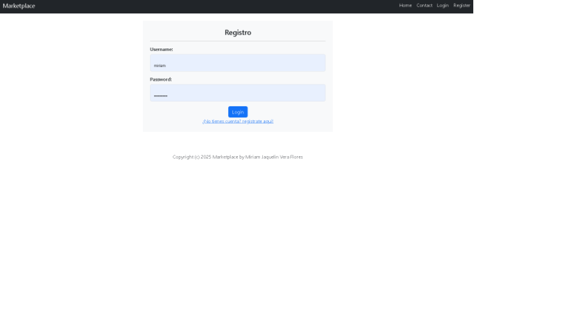

---

El archivo **signup.html** es la página de registro. Su cometido es permitir que un nuevo usuario cree una cuenta en la aplicación. Contiene un formulario con campos como nombre, correo y contraseña, y se apoya en el UserCreationForm de Django o en un formulario personalizado.

**CÓDIGO DE SIGNUP.HTML**
```html


Registro| 



\<div class\="row p-4 d-flex justify-content-center align-items-center"\>

    \<div class\="col-6 bg-light p-4"\>

        \<h4 class\="mb-6 text-center"\>Registro\</h4\>

        \<hr\>

        \<form action\="." method\="POST"\>

            

            \<div class\="form-floating mb-3"\>

                \<h6\>Username:\</h6\>

                {{form.username}}

            \</div\>

            \<div class\="form-floating mb-3"\>

                \<h6\>Email:\</h6\>

                {{form.email}}

            \</div\>

            \<div class\="form-floating mb-3"\>

                \<h6\>Password:\</h6\>

                {{form.password1}}

            \</div\>

            \<div class\="form-floating mb-3"\>

                \<h6\>Repite Password:\</h6\>

                {{form.password2}}

            \</div\>

            

                \<div class\="mb-4 p-6 bg-danger rounded"\>

                    

                        \<h5 class\="text-white"\>

                            {{field.errors}}

                        \</h5\>

                       

                    

                    {{ form.non\_field\_errors }}

                \</div\>

            

            \<div class\="d-flex justify-content-center align-items-center"\>

                \<button class\="btn btn-primary mb-6"\>Register\</button\>

            \</div\>

            \<div class\="d-flex justify-content-center align-items-center"\>

                \<a href\=""\>¿Ya tienes cuenta? Accesa aqui\!\</a\>

            \</div\>

        \</form\>

    \</div\>

\</div\>


```

**EJECUCIÓN DE LA APLICACIÓN EN STORE:**

Nos dirigimos al apartado de Register, el cual nos permite crear una cuenta, rellenando los siguientes campos que aparecen en la vista:

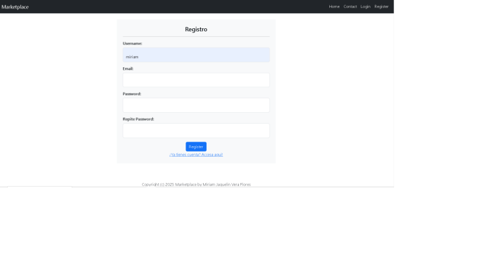

---

El archivo **navigation.html** es un fragmento reutilizable que define la barra de navegación del sitio. Su función es ofrecer acceso rápido a secciones principales como *home*, *contact*, *logout*, *login* y *register*. Se integra mediante la directiva ****, lo que permite heredar la estructura de una plantilla base y mantener una apariencia coherente en todas las páginas.

**CÓDIGO DE NAVIGATION.HTML**
```html
\<nav class\="navbar navbar-expand-lg bg-dark" data-bs-theme\="dark"\>

    \<div class\="container-fluid"\>

        \<a href\="" class\="navbar-brand"\>Marketplace\</a\>

        \<button class\="navbar-toggler" type\="button" data-bs-toggle\="collapse" data-bs-target\="\#navbarNav" aria-control\="navBarNav" aria-expanded\="false" aria-label\="Toggle Navigation"\>

            \<span class\="navbar-toggler-icon"\>\</span\>

        \</button\>

        \<div class\="collapse navbar-collapse" id\="navbarNav"\>

            \<ul class\="navbar-nav ms-auto"\>

                \<li class\="nav-item"\>

                    \<a href\="" class\="nav-link active"\>

                        Home

                    \</a\>

                \</li\>

                \<li class\="nav-item"\>

                    \<a href\="" class\="nav-link active"\>

                        Contact

                    \</a\>

                \</li\>

               

                

                    \<li class\="nav-item"\>

                        \<a class\="nav-link" href\=""\>Add Item\</a\>

                    \</li\>

                    \<li class\="nav-item"\>

                        \<a href\="" class\="nav-link active"\>

                            Logout

                        \</a\>

                    \</li\>

                

                    \<li class\="nav-item"\>

                        \<a href\="" class\="nav-link active"\>

                            Login

                        \</a\>

                    \</li\>

                    \<li class\="nav-item"\>

                        \<a href\="" class\="nav-link active"\>

                            Register

                        \</a\>

                    \</li\>

                

            \</ul\>

        \</div\>

    \</div\>

\</nav\>
```

**EJECUCIÓN DE LA APLICACIÓN EN STORE:**

De acuerdo con el archivo de navigation.html este nos permite tener una barra de navegación en nuestra página, en la cual contamos con, *Home, Contact, Login* y *Register*, al dar clic en una de ellas, nos dirige a una nueva página, esto depende a qué apartado demos clic:

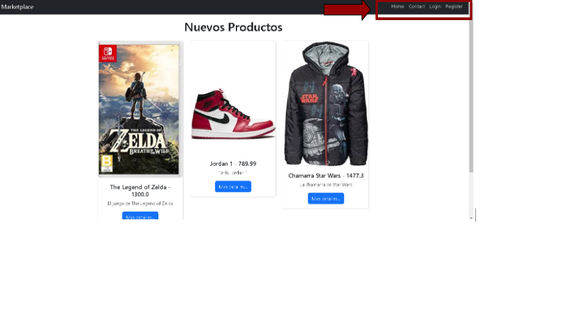

---

Finalmente, el archivo **form.html** es un template genérico para mostrar formularios. Su cometido es evitar repetir código, ya que puede usarse para distintos formularios como login, registro o añadir productos. Se encarga de renderizar los campos y el botón de envío, aprovechando la sintaxis de Django para mostrar cualquier formulario pasado desde las *views*.

**CÓDIGO DE FORM.HTML**
```html


 {{ title }} 



    \<h4 class\="mb-4 mt-4"\>{{ title }}\</h4\>

    \<hr\>

    \<form action\="." method\="POST" enctype\="multipart/form-data"\>

        

        \<div\>

       

            {{ form.as\_p }}

        \</div\>

        

            \<div class\="mb-4 p-6 bg-danger"\>

                

                    {{ field.errors }}

                

                {{ form.non\_field\_errors }}

            \</div\>

        

        \<button class\="btn btn-primary mb-6"\>Register\</button\>

    \</form\>


```

**EJECUCIÓN DE LA APLICACIÓN EN STORE:**

El archivo de form.html construye una página de registro y nos muestra un formulario, esperando que al enviar el formulario, Django valide los datos y procese la información si está correcta, el archivo de form.html tiene una ejecución como se muestra a continuación:

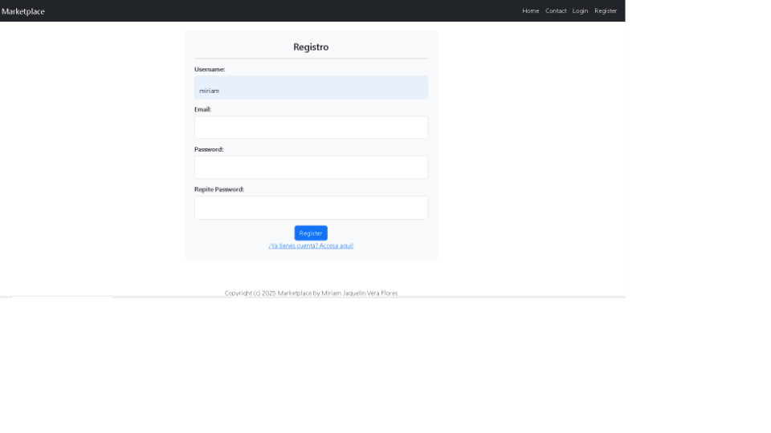

# **CONCLUSIÓN**

Al finalizar esta práctica, logramos comprender de manera más completa cómo se organizan y funcionan los distintos archivos de Django para construir aplicaciones web escalables. Ahora contamos con una base sólida que nos permitirá avanzar hacia proyectos más complejos, aprovechando las herramientas que ofrece el framework para trabajar de forma rápida, ordenada y eficiente.

Durante el desarrollo, integramos cuidadosamente la información proporcionada por el profesor y aplicamos los conceptos en la creación de una página web tipo marketplace. Gracias a esto, implementamos funciones clave como el inicio y cierre de sesión, el registro de usuarios, la visualización de detalles de los productos y la posibilidad de agregar nuevos ítems. Parte de este aprendizaje incluyó el uso del archivo forms.py, donde definimos formularios como LoginForm, SignupForm y NewItemForm, además de varias vistas en views.py que permiten manejar la lógica detrás de estas acciones.

También comprendimos la utilidad del decorador login\_required para proteger secciones que deben ser accesibles sólo para usuarios autenticados, así como la importancia de los templates para mostrar la información de manera visual y ordenada en páginas como login.html, item.html o form.html. Todo esto nos permitió ver cómo Django integra la parte lógica con la parte visual de una manera clara y eficiente.

En conclusión, este proyecto nos mostró que Django es un framework muy útil para desarrollar aplicaciones web completas, seguras y escalables. Su estructura bien organizada nos facilita trabajar sin tener que comenzar desde cero y nos ahorra tiempo, ofreciendo herramientas listas para usar que mejoran el flujo de trabajo y permiten construir proyectos profesionales desde las bases hasta sus funciones avanzadas.
